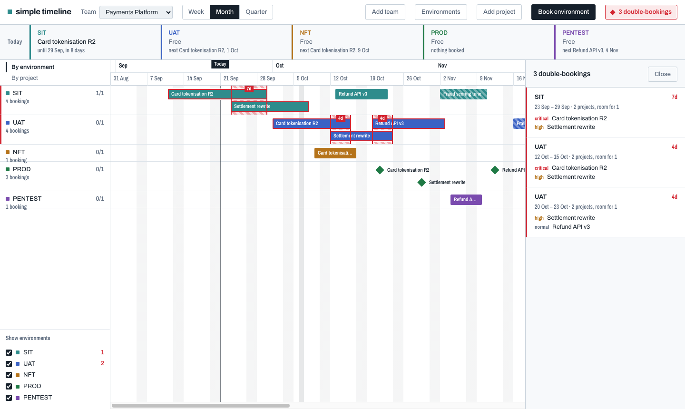

# simple timeline

A booking board for delivery environments. Teams own environments (SIT, UAT, PROD, …);
projects book them; the board shows where two projects want the same environment at once.



## Run it

```bash
npm install
npm run seed     # demo data, with deliberate double-bookings
npm run dev      # http://localhost:5173
```

`npm run dev` starts the API (port 5174) and the Vite dev server (5173) together.
For a single-process production run:

```bash
npm run build && npm start   # http://localhost:5173
```

Requires Node 24+. There is no native dependency and no build step for the server —
SQLite comes from `node:sqlite` and TypeScript runs through Node's own type stripping.

| Command | Does |
|---|---|
| `npm run dev` | API + client with hot reload |
| `npm run build` | Bundle the client into `dist/` |
| `npm start` | Serve API and `dist/` from one port |
| `npm run seed` | Reset to demo data |
| `npm test` | Unit tests (43) |
| `npm run typecheck` | `tsc --noEmit` |

The database is a single file at `data/timeline.db`. Delete it to start clean;
the schema is recreated on boot. Override with `TIMELINE_DB=/path/to.db`.

## Managing things

Everything is editable from the board. Three manager dialogs in the top bar, all the
same shape — a list, inline editing, an add row:

| | Add | Edit | Remove |
|---|---|---|---|
| **Teams** | name + code; seeded with SIT, UAT, PROD | rename, recode | cascades to its projects and bookings |
| **Projects** | name, owner, priority, status | all fields | cascades to its bookings |
| **Environments** | name, kind, capacity | all three, inline | blocked while bookings reference it |
| **Bookings** | *Book environment*, or *Book* on a project | click any bar | from the booking dialog |

Clicking a row label in the left rail opens the editor for that environment or project.

### Dragging bookings on the board

Drag a bar to move it; drag either edge to resize. While you drag, a readout follows
the pointer with the dates and working-day length, and **conflict detection runs live** —
if the drop would double-book an environment, the red frame, the toolbar count and the
readout all say so before you let go. Press **Escape** mid-drag to abandon it.

Moving preserves the working-day length, so a five-day booking dragged across a weekend
stays five working days rather than silently growing. Both ends always land on working
days.

The same edits work from the keyboard, so the board does not need a pointer:

| Key | Does |
|---|---|
| Tab | step through the bars |
| Enter / Space | open the booking |
| ← → | move by one working day |
| Shift + ← → | drag the end edge |
| Alt + ← → | drag the start edge |

A run of key presses is written once, when you stop.

Destructive actions arm before they fire: the first click turns *Remove* into a statement
of what goes with it — "Removes 4 projects and 13 bookings — go ahead?" — and disarms itself
after a few seconds if you do nothing. A project with no bookings still gets a row on the
board, marked "nothing booked yet", so it can always be reached.

## Moving it to another Mac

Build here, run there. On this machine:

```bash
npm run pack
```

That typechecks, runs the tests, builds the client, installs only the runtime
dependency, vendors the fonts, folds your database into a clean single file, and
writes `simple-timeline-<date>.zip` (about 1.4 MB).

Copy the zip across, unzip, and double-click `start.command` — or run `npm start`.
The target Mac needs **Node 24 or newer** and nothing else: no build step, no
`npm install`, no internet. `docs/RUNNING.md` ships inside the bundle with the
full setup notes.

| Flag | Effect |
|---|---|
| `--no-data` | ship an empty database instead of your current one |
| `--no-fonts` | skip vendoring; the target loads fonts from Google, or falls back to system sans |
| `--out <path>` | write the zip somewhere else |

The database is copied with `VACUUM INTO`, not `cp`. SQLite runs in WAL mode, so
recent edits live in `timeline.db-wal` and copying `timeline.db` alone ships a
stale database.

## The idea

A project *books* an environment for a span of dates. An environment has a **capacity** —
how many projects may hold it at once, normally one. Any stretch where bookings exceed
capacity is a **double-booking**, and finding those is the point of the tool.

Two views over the same data:

- **By environment** (default) — one row per environment, competing projects stacked inside.
  Overlaps are visible as a physical pile, with red frames bracketing the days over capacity.
- **By project** — one row per project, bars labelled by the environment each one holds.

### Effort and occupancy are different

Durations count **working days**: weekends and holidays are skipped, and bookings snap to
working days when you save them.

Occupancy counts **calendar days**: a booking from Friday to Monday is two working days of
effort but holds the environment right through the weekend. Conflict detection uses the
calendar span, because an environment is not handed back on Friday and reclaimed on Monday.

The booking dialog states both when they differ.

### What counts towards a conflict

| | Counts |
|---|---|
| Committed booking | Yes |
| Tentative booking | No — rendered hatched, so early planning does not cry wolf |
| Release milestone | No — a release is a moment, it holds nothing |

Conflicts are ranked by severity: overlap days × the highest project priority involved.

## Layout

```
shared/     dates.ts, conflicts.ts   — pure logic, used by both server and client
server/     Express API over SQLite; schema.sql is the source of truth
client/     React board renderer; layout.ts does the time scale and lane packing
tests/      Vitest over shared/ and the client's pure layout functions
```

`shared/conflicts.ts` is a sweep line over each environment's bookings, O(n log n). It lives
in `shared/` so the server and the client run identical code — which is what makes live
conflict preview during drag-to-edit cheap to add.

## Not built yet

Drag-to-edit, sub-project roll-ups, conflict acknowledgement, saved views, bulk date shift,
dependency arrows, and export. See `DESIGN.md` §12.
