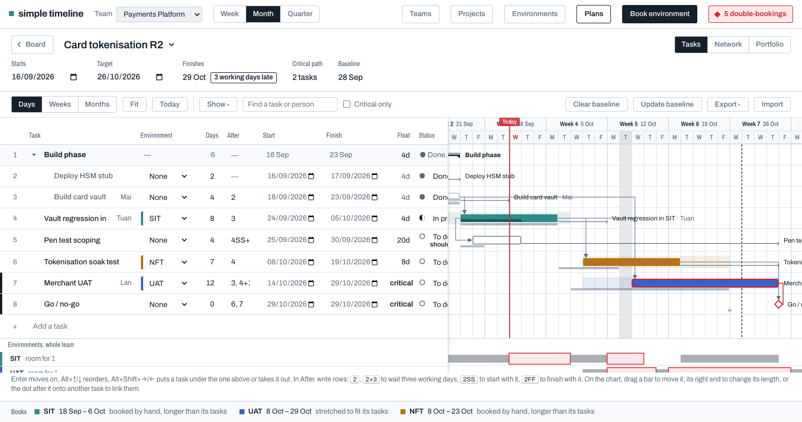

# Plan Gantt chart

The Tasks view of a project's plan is a table with a Gantt chart beside it. The table enters
work fast; the chart shows its shape, lets you move it by hand, and shows, while you move it,
whether it would double-book an environment. That last part is what no general project tool
does, and why this chart exists in a booking board.

## Read this first

| If you want to… | Read |
|---|---|
| Use the chart | [User guide](user-guide.md) |
| Change the code | [Architecture](architecture.md), then the rules in `CLAUDE.md` |
| Touch the database, API or file formats | [Data, API and files](data-and-api.md) |
| Check a change works | [Testing](testing.md) |
| Know what is missing or fragile | [Roadmap and limits](roadmap.md) |
| Know why it is the way it is | [`reqs/gantt_chart.md`](../../reqs/gantt_chart.md) and `DESIGN.md` §16.4 |
| See when things landed | [Changelog](changelog.md) |

`DESIGN.md` §16.4 is the source of truth for design decisions; these pages explain and index
them and must not contradict it. When they disagree, fix this folder.

## At a glance

- **Where:** Plans → a project → **Tasks** tab (chart), **Network**, **Portfolio**.
- **Scale:** weekdays only; zoom steps Days / Weeks / Months.
- **Marks:** bars in the environment's hue, hollow when a task books nothing; summaries as ink
  brackets; milestones as diamonds; critical path outlined and linked in red; float tails;
  grey baseline under each bar with `+Nd` variance; progress band; today line; target line.
- **Editing:** drag, resize, link, click a link to edit it; Alt+arrows from the keyboard. Every
  edit is saved exactly as a typed date or After entry would be, with the same impact banner and
  Undo.
- **Environments:** a strip under the chart shows how full each environment is across the whole
  team, with double-bookings in red; it updates live while you drag.
- **Outline:** summary tasks (indent and outdent), SS and FF links, baselines, progress.
- **Files:** CSV and MS Project XML in and out; print to PDF.
- **Portfolio:** every plan of the team on one read-only chart.

## Status

Built and pushed to `main` on 2026-09-29. 202 unit tests. Open items:
[roadmap](roadmap.md).
